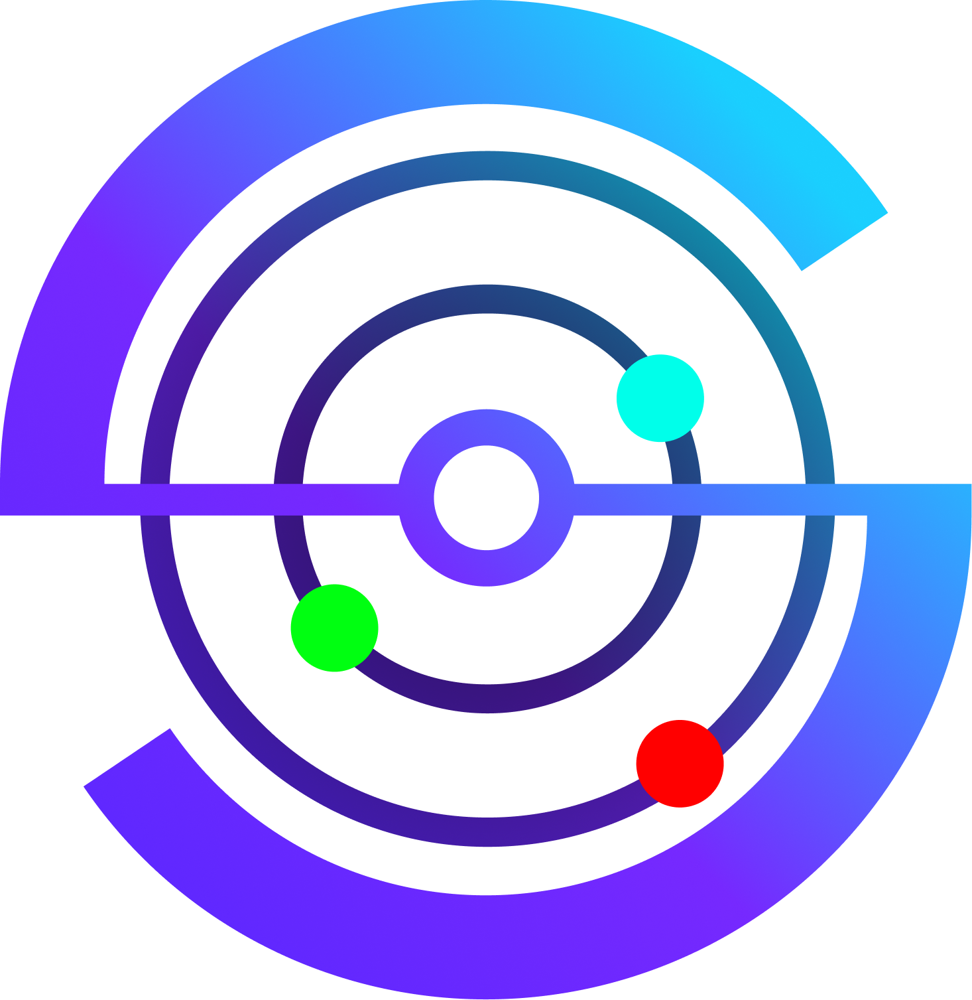

<p align="center">
  
</p>

<h1 align="center">StreamSift</h1>

<p align="center">
  <strong>Understand Your Audience. Instantly.</strong>
</p>

<p align="center">
  Real-time audience intelligence tool for streamers and content creators.<br/>
  Get instant clarity on your audience engagement with AI-powered sentiment analysis.
</p>

<p align="center">
  
  
</p>

---

## ✨ Features

- **Real-time Live Chat Analysis** – Monitor live stream chat sentiment as it happens for **YouTube**, **Twitch**, and **Kick**.
- **Platform Auto-Detection** – Just paste a URL; the app automatically detects the platform and configures the connection.
- **Historical Context (Pre-loading)** – Automatically fetches the last 40 metadata-rich comments on connection to give you immediate sentiment context before you even start.
- **AI-Powered Sentiment Classification** – Uses a hybrid approach with **scikit-learn** ML models for speed and **Gemini Pro** for nuanced batch classification.
- **Analytical Summaries** – Nuanced, real-time summaries of the audience mood (e.g., "Overwhelmingly positive", "Vocal negativity").
- **Dynamic AI Recommendations** – Generative suggestions based on current audience mood to help you steer your stream.
- **Static Video Analysis** – Deep-dive into historical comments on any YouTube video for a complete sentiment breakdown.

---

## 🛠️ Tech Stack

### Frontend
- **Next.js 14** – High-performance React framework with App Router.
- **Tailwind CSS** – Modern styling with a premium glassmorphic feel.
- **Lucide React** – Clean and consistent iconography.
- **Framer Motion** – Smooth micro-animations and transitions.

### Backend
- **Flask** – Lightweight and robust REST API & WebSocket server.
- **Flask-SocketIO** – Real-time bidirectional communication for live chat updates.
- **scikit-learn** – Core ML engine for fast local sentiment classification.
- **Google Generative AI (Gemini Pro)** – Advanced context-aware classification and summaries.
- **WebSockets** – Dedicated clients for Twitch (IRC) and Kick (Pusher).

---

## 📁 Project Structure

```
streamsift/
├── app/                          # Next.js App Router
├── components/                   # Premium UI Components
├── backend/                      # Flask Python Backend
│   ├── app.py                    # Main Server & Platform Clients
│   ├── requirements.txt          # Python Dependencies
│   └── *.sav, *.pkl              # ML ML Model Artifacts
├── public/                       # Assets & Brand Identity
├── Dockerfile.backend            # Production Deployment Config
└── tailwind.config.js            # Design System
```

---

## 🚀 Getting Started

### Prerequisites
- **Node.js** 18+
- **Python** 3.10+
- **YouTube Data API Key**
- **Gemini AI API Key** (Free from Google AI Studio)

### 1. Installation

```bash
# Clone the repository
git clone https://github.com/ArjunKH2004/final.git
cd streamsift

# Frontend Setup
npm install
npm run dev

# Backend Setup (in a separate terminal)
cd backend
python -m venv venv
# Windows: .\venv\Scripts\activate | Unix: source venv/bin/activate
pip install -r requirements.txt
python app.py
```

### 2. Configuration
The backend expects the following environment variables (or hardcoded in `app.py`):
- `YOUTUBE_API_KEY`
- `GEMINI_API_KEY`

---

## 📡 API Endpoints

| Endpoint | Method | Description |
|----------|--------|-------------|
| `/api/twitch/connect` | POST | Initialize Twitch IRC connection |
| `/api/kick/connect` | POST | Initialize Kick Pusher connection |
| `/get-live-chat-id` | POST | Get YouTube live chat ID |
| `/analyze-live` | POST | Poll YouTube live messages |
| `/analyze` | POST | Static YouTube comment analysis |

---

## 🗺️ Roadmap

- [x] YouTube Live Support
- [x] YouTube Static Analysis
- [x] Twitch Integration
- [x] Kick Integration
- [x] Historical Message Pre-loading
- [x] Real-time AI Recommendations
- [ ] Multi-channel Dashboard
- [ ] Exportable Sentiment Reports (.csv / .pdf)
- [ ] Dark/Light Mode Advanced Customization

---

<p align="center">
  Made with ❤️ for content creators
</p>
